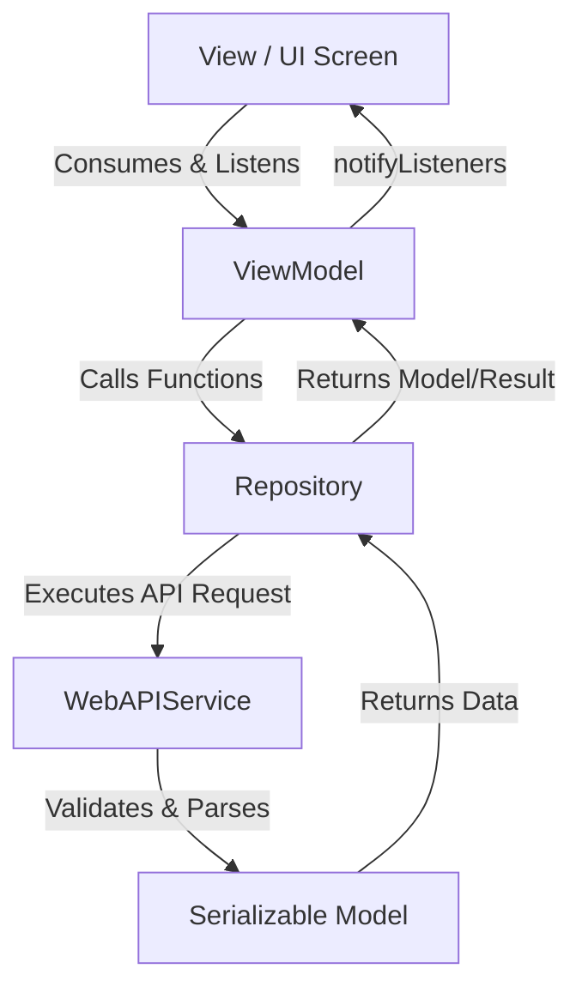

# Architecture Source of Truth

This project follows a strict **MVVM (Model-View-ViewModel) architecture** layered on top of the **Provider package** for state management and DI.

## Codebase Directory Structure

All application source code resides under `lib/` and is divided logically as follows:

```
lib/
├── configs/            # Application environments and global configs (app_configs.dart)
├── features/           # Feature folders containing views, view models, repo, and models
│   └── <feature_name>/
│       ├── view/       # Presentation layer (Widgets, Screens)
│       ├── view_model/ # State & logic layer (ViewModel classes)
│       ├── model/      # Feature-specific API models (if applicable)
│       └── repo/       # Feature-specific repositories (if applicable)
├── helpers/            # Infrastructure services (sp_helper.dart, url_helpers.dart)
├── l10n/               # Localization templates (app_en.arb)
├── models/             # Shared or application-wide models (app_error_model.dart)
├── providers/          # Global state management and abstract bases (_base.dart, _mixins.dart, view_model.dart)
├── services/           # Mixins and HTTP client implementation (_mixins_api.dart, web_api_services.dart)
├── utils/              # UI theme, style sheets, palettes, routing, and extensions
└── widgets/            # Globally reusable atomic UI components (buttons, input fields)
```

## Layer Responsibilities



### 1. View Layer (UI)
- Handled inside `features/<feature>/view/`.
- Written as `StatelessWidget` or `StatefulWidget`.
- **Constraint**: Must never contain business logic, manual state manipulation, or API calls.
- **Provider Connection**: Created via `ChangeNotifierProvider` or `ChangeNotifierProvider.value` at the parent view level.
- Rebuilds must be optimized using `Consumer` or `Selector` elements to target specific UI sections.

### 2. ViewModel Layer
- Handled inside `features/<feature>/view_model/`.
- Must extend the abstract `ViewModel` base class (defined in `lib/providers/view_model.dart`).
- Extends `BaseProvider` and inherits `MixinProgressProvider` and `MixinAPIProvider` characteristics.
- Holds UI state variables (e.g. checkbox selections, current input text, lists).
- Exposes `getters` and `setters` that call `notifyListeners()` when values change.
- Invokes API functions in the repository and wraps execution in loading states.

### 3. Repository Layer (Data Link)
- Handled inside `features/<feature>/repo/` implemented strictly as **class extensions on `WebAPIService`** (e.g. `extension ProfileRepo on WebAPIService`).
- Extends the core API service client to provide clean semantic methods directly on `WebAPIService` instances (e.g. `WebAPIService().fetchProfileDetails(...)`).
- Translates network responses into structured Dart Models.

### 4. Service / Helper Layer (Networking & Cache)
- **`WebAPIService`**: Singleton orchestrator for Dio. Contains:
  - `initTokenToHeader()`: Adds the saved JWT bearer token to the HTTP header.
  - `initLangPrefToHeader()`: Adds the selected locale code to the header.
  - `executeAPI()`: Standardized runner for requests. Handles status verification via `validateResStatusData` and mapping to model format.
- **`SpHelper`**: Fast local cache access (Shared Preferences).

## Base Providers Reference

- `BaseProvider`: Base class managing OS/platform characteristics.
- `ViewModel`: Handles infinite pagination features (`fetchListData`), page indexes, and pagination status (`canLoadMore`).
- `MixinProgressProvider`: Controls `isLoading` states and exposes tools to run asynchronous tasks (`callWithInProgress`, `setProgress`) or register delayed tasks.
- `MixinAPIProvider`: Implements custom exception parsing `handleAPIException` for different server code violations.
