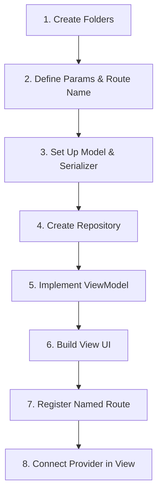

# Feature Building Workflow

This document outlines the step-by-step workflow for implementing a new feature in this application.

## Workflow Pipeline



---

### Step 1: Create Feature Subfolders
Create the directory structure under `lib/features/<new_feature_name>`:
```
lib/features/<new_feature_name>/
├── model/      # Serializable models
├── repo/       # Api repositories
├── view/       # Screen & widgets
└── view_model/ # Provider/ChangeNotifier state
```

### Step 2: Define Route Name and Params Class
1. Inside `view/<new_feature_name>_screen.dart`, define the static route name string:
   ```dart
   static const String routeName = '/NewFeatureScreen';
   ```
2. If arguments are passed to this screen, create a params wrapper class:
   ```dart
   class NewFeatureScreenParams {
     final String id;
     NewFeatureScreenParams({required this.id});
   }
   ```

### Step 3: Implement the Network Model
- Define the serializable response structure under `model/`.
- Add `@JsonSerializable()` annotations and standard factory mappings:
  ```dart
  import 'package:json_annotation/json_annotation.dart';
  part 'new_feature_model.g.dart';

  @JsonSerializable()
  class NewFeatureModel {
    final String id;
    NewFeatureModel({required this.id});

    factory NewFeatureModel.fromJson(Map<String, dynamic> json) => _$NewFeatureModelFromJson(json);
    Map<String, dynamic> toJson() => _$NewFeatureModelToJson(this);
  }
  ```
- Run the build code generator:
  ```bash
  fvm flutter pub run build_runner build --delete-conflicting-outputs
  ```

### Step 4: Write the Repository
- Create the repository under `repo/` implemented as a Dart extension on `WebAPIService`.
- **Header Chaining Rule**: You must chain all required header initializations (e.g. `initLangPrefToHeader()`, `initTokenToHeader()`) sequentially using `.then()` inside the `methodToCall` Future to guarantee headers are set correctly before execution:
  ```dart
  import 'package:base_project/services/web_api_services.dart';
  import 'package:base_project/utils/urls.dart';
  import '../model/new_feature_model.dart';

  extension NewFeatureRepo on WebAPIService {
    Future<NewFeatureModel> getDetails({required String id}) {
      return executeAPI(
        methodToCall: initLangPrefToHeader().then(
          (value) => dio.get('$urlRegistration/$id'),
        ),
        converter: (responseMap) => NewFeatureModel.fromJson(responseMap as Map<String, dynamic>),
      );
    }
  }
  ```

### Step 5: Implement the ViewModel
- Must extend `ViewModel` from `providers/view_model.dart`.
- Bind async actions within progressive loading wrappers using `setProgress(this)`:
  ```dart
  import 'package:base_project/providers/view_model.dart';
  import 'package:base_project/services/web_api_services.dart';
  import 'package:base_project/utils/extensions.dart';
  import '../model/new_feature_model.dart';
  import '../repo/new_feature_repo.dart';

  class NewFeatureViewModel extends ViewModel {
    NewFeatureModel? _details;
    NewFeatureModel? get details => _details;

    Future<void> loadDetails(String id) async {
      await WebAPIService()
          .getDetails(id: id)
          .then((data) {
            _details = data;
            notifyListeners();
          })
          .setProgress(this); // Automatically sets isLoading true/false
    }
  }
  ```

### Step 6: Create/Update Route Registrations
1. Open `lib/utils/routes.dart`.
2. Register static views or dynamic screens inside `_getScreen()`:
   ```dart
   // For dynamic parameter routes:
   case NewFeatureScreen.routeName:
     final params = settings.arguments as NewFeatureScreenParams;
     return NewFeatureScreen(params: params);
   ```

### Step 7: Build the View Layer
- Keep the view thin and focused strictly on parsing the UI elements.
- Inject the `ChangeNotifierProvider` immediately above the Scaffold or layout wrapper.
- Use `Consumer<NewFeatureViewModel>` to capture data updates and prevent unnecessary parent view rebuilds.
- Always implement progressive spinners via the extensions:
  ```dart
  @override
  Widget build(BuildContext context) {
    return ChangeNotifierProvider<NewFeatureViewModel>(
      create: (_) => NewFeatureViewModel()..loadDetails(widget.params.id),
      child: Scaffold(
        body: Consumer<NewFeatureViewModel>(
          builder: (context, vm, _) {
            return Column(
              children: [
                Text(vm.details?.id ?? ""),
              ],
            );
          },
        ).showCircleProgressOnCenter<NewFeatureViewModel>(), // Automatically displays spinner on loading states
      ),
    );
  }
  ```
