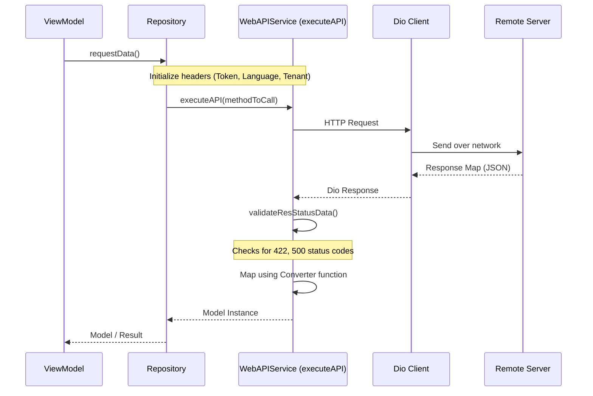

# API Integration Standard

This document details the standardized network communications architecture using `WebAPIService`, exception catching, and token-session management.

## Network Architecture & Execution Flow

All network operations are executed via a unified service client: **`WebAPIService`** (a Dio singleton found in `lib/services/web_api_services.dart`).



## Request Header Initialization

Before firing network operations, headers must be initialized inside the repository or network client by invoking helper loaders sequentially. This is handled via:

- `initTokenToHeader()`: Fetches the stored token using `getTokenFromSharedPref()` and appends it to headers: `Authorization: Bearer <token>`.
- `initLangPrefToHeader()`: Resolves the current language code using `getLanguageSharedPref()` and appends it to header key: `lang`.
- `initTenantPrefToHeader()`: Resolves tenant configuration and appends it to headers under `tenant`.

## API Request Execution Standard (`executeAPI`)

All endpoints must be executed via repository methods defined as extensions on `WebAPIService` that call `executeAPI` to leverage built-in response parsing, error mapping, and automatic loading handlers.

**MANDATORY Header Chaining Pattern**: You must dynamically chain all required header operations (e.g. `initTokenToHeader`, `initLangPrefToHeader`, `initTenantPrefToHeader`) sequentially using `.then()` inside the `methodToCall` Future. This guarantees that parameters are safely committed to the shared Dio request options object before the HTTP call launches:

```dart
extension MyFeatureRepo on WebAPIService {
  Future<MyModel> fetchMyData() {
    return executeAPI<MyModel>(
      methodToCall: initTokenToHeader().then(
        (value) => initLangPrefToHeader().then(
          (value) => dio.get(urlMyEndpoint),
        ),
      ),
      converter: (responseMap) => MyModel.fromJson(responseMap as Map<String, dynamic>),
      onSuccess: (value) => debugPrint("Successfully retrieved MyModel"),
      onError: (appError) => debugPrint("Failed with error: ${appError.message}"),
    );
  }
}
```

## Exception Parsing & Session Invalidation

This project implements centralized error mapping logic inside the network mixin (`lib/services/_mixins_api.dart`):

### 1. Dio Exceptions (`onDioException`)
- Handles `DioException` cases such as timeouts, connection failures, and request cancellations.
- **Connection Issues**:
  - Automatically redirects to `/ConnectionFailedScreen` inside `onDioException` when an active internet connectivity failure is detected.
- **Bad Responses**:
  - Checks if the response map contains authentication or token failures (`"Message": "Unauthenticated"` or `"message": "Unauthenticated"`).
  - Triggers an `APIException` with `EnumAPIExceptions.invalidToken`, which immediately logs the user out.
- **Rule**:
  - Always use `DioException` and `DioExceptionType` for API and network exception handling. Never use `DioError`, as it is deprecated in newer Dio versions (`dio: ^5.x`).

### 2. Status Validation (`validateResStatusData`)
- Parses incoming JSON and extracts specific API-level status codes:
  - **`500` Server Errors**: Translates message payload into a readable warning.
  - **`422` Validation Failures**: Triggers validation exceptions showing the message block.

### 3. Session Invalidation (`onInvalidToken`)
- When an expired or corrupted session is validated:
  - Invokes `signOutUser()` which clears the database and sets configuration properties back to defaults.
  - Clears all cached user data stored in `SharedPreferences` (`SpHelper.clearAll()`).
  - Forces navigation back to the login page via named routing, stripping any active navigation stack to prevent unauthorized back-scrolling:
    ```dart
    AppConfig.navKey.currentState.pushNamedAndRemoveUntil(
      LoginScreen.routeName,
      (route) => false,
    );
    ```
